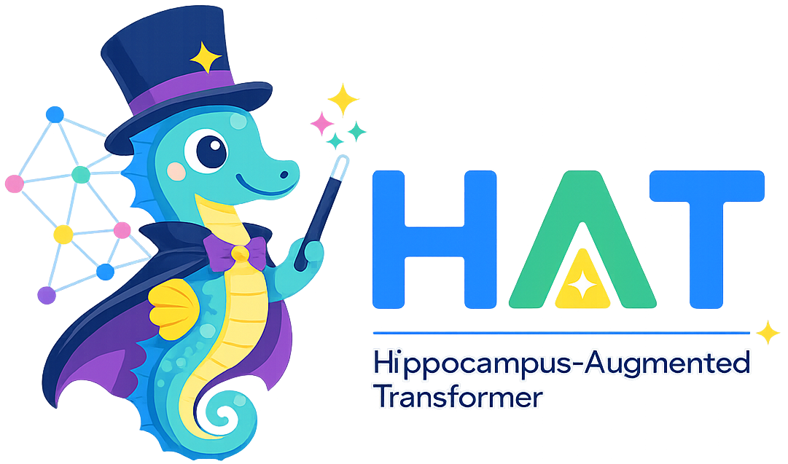

<p align="center">
  
</p>

# HAT — Hippocampus-Augmented Transformer

Reference implementation of the wake–sleep selective-memory-consolidation system from
*Learning What to Learn: Hippocampal Memory Consolidation for Continual Model Adaptation*.

This is a **skeleton**: protocols, ABCs, and a no-op end-to-end path. Real model loading,
training, and benchmark code land in subsequent iterations.

## Quickstart

```bash
uv sync
make serve         # FastAPI + web UI on :8000
make sleep         # run a slow-wave-sleep cycle (dry-run by default)
make test
```

The web UI (vanilla HTML/CSS/JS) is served by the same FastAPI process at
<http://127.0.0.1:8000/>. There is no separate UI server to launch.

The default Cortex is a no-op echo so the loop runs without ML deps. To chat
with a real local model, see **Local model chat** below — pick the backend
that matches your machine.
## Local model chat — Apple Silicon (M1/M2/M3, recommended on Mac)

Use the **MLX** backend (Apple's official Metal-native runtime). On an 8 GB
M1, a 4-bit Qwen 1.5B runs comfortably (~1.5 GB resident, ~30–60 tok/s).

```bash
uv sync --extra mlx
```

Set in `.env`:

```env
HAT_CORTEX_BACKEND=mlx
```

Models are downloaded from the **Models** tab in the web UI (or via
`POST /api/models/download`) into `model/mlx/<id>/`. The catalog ships with
8 GB-friendly defaults including `qwen2.5-1.5b-instruct-4bit` (≈1.0 GB,
default), `qwen3.5-2b-optiq-4bit` (≈1.5 GB), `qwen3.5-4b-optiq-4bit`
(≈3.0 GB, recommended quality/footprint pick).

Then:

```bash
make serve   # → http://127.0.0.1:8000
```

## Local model chat — HuggingFace (CUDA / generic)

Use the **HF** backend if you have a CUDA box or want full PyTorch control.

1. Install the HF extra (downloads PyTorch + transformers):

   ```bash
   uv sync --extra hf
   ```

2. Configure the backend. Copy `.env.example` to `.env` and set:

   ```env
   HAT_CORTEX_BACKEND=hf
   HAT_HF_DEVICE=auto         # auto | cpu | cuda | mps
   HAT_HF_DTYPE=auto          # auto | float16 | bfloat16 | float32
   ```

3. Start the server, open <http://127.0.0.1:8000/>, and download a model
   from the **Models** tab. Weights land under `model/hf/<id>/`.

   ```bash
   make serve
   ```

Per-call generation parameters (temperature, max tokens) and Qwen3-style
**think-mode** toggles ("Enable thinking", "Show thinking process") are
exposed in the chat UI under "Generation settings". They are forwarded to the
OpenAI-compatible endpoint as `temperature`, `max_tokens`, and
`extra_body.chat_template_kwargs.enable_thinking`, so you can tune them
without touching env vars. The chat UI streams tokens incrementally; if "Show
thinking process" is off, the `<think>…</think>` block is filtered out
client-side while still being generated.

## OpenAI-compatible API

The server exposes an OpenAI-compatible endpoint, so you can also point any
OpenAI client at it:

```python
from openai import OpenAI

client = OpenAI(base_url="http://127.0.0.1:8000/v1", api_key="hat-local")

# Streaming + Qwen3 think-mode toggle
stream = client.chat.completions.create(
    model="hat-cortex",
    messages=[{"role": "user", "content": "hello"}],
    stream=True,
    extra_body={"chat_template_kwargs": {"enable_thinking": False}},
)
for ev in stream:
    if ev.choices and (delta := ev.choices[0].delta.content):
        print(delta, end="", flush=True)
```

Each call still flows through the wake step, so the Hippocampus Agent will
score the turn and (selectively) consolidate it into the Neocortex. The
final SSE chunk carries `hat_consolidated` / `hat_trace_id` extras for
clients that want to surface that signal.

## Model management

Weights are not configured via env. Instead the server exposes a small REST
surface (mirrored by tabs in the web UI):

| Method & path | Purpose |
| --- | --- |
| `GET /api/models?backend=mlx\|hf` | List the catalog with installed status |
| `POST /api/models/download` | `snapshot_download` a catalog entry into `model/<backend>/<id>/` |
| `POST /api/models/active` | Load + set the active Cortex (evicts the previous one first to keep peak GPU/Metal memory at one model) |
| `GET  /api/models/active` | Current active model |
| `DELETE /api/models/active` | Unload **all** cached models, free GPU/Metal memory, fall back to the Noop cortex |

Catalogs live in [src/hat/models/catalogs/](src/hat/models/catalogs/) as
YAML; `mlx.yaml` curates ~18 quantised entries for Apple Silicon and
`hf.yaml` lists 6 HF baselines.

## Architecture

```
                ┌──────────┐  query   ┌──────────────────┐
   user  ──────▶│  Cortex  │─────────▶│  Hippocampus     │
                └──────────┘  resp    │  abs / sel /     │
                                      │  replay          │
                                      └──────┬───────────┘
                                             │ WriteDecision
                                             ▼
                       ┌──────────────┐         ┌──────────────┐
                       │ Raw chat log │ (TTL)   │  Neocortex   │
                       │ (append-only)│         │  (curated)   │
                       └──────────────┘         └──────┬───────┘
                                                       │ replay batch
                                                       ▼
                                              ┌────────────────────┐
                                              │   SWS Trainer      │
                                              │ L_sup+λ_KD+λ_stab  │
                                              └─────────┬──────────┘
                                                        │ θ^{t+1}
                                                        ▼
                                                    (Cortex)
```

## Paper → module map

| Paper section                     | Module                                            |
| --------------------------------- | ------------------------------------------------- |
| §3.3 Cortex                       | `hat.core.cortex`                                 |
| §3.4 Hippocampus Agent            | `hat.core.hippocampus`                            |
| §3.4.1 Abstraction                | `hat.core.hippocampus.abstraction`                |
| §3.4.2 Selection (αU+βF+γN)       | `hat.core.hippocampus.selection` + `scoring/`     |
| §3.4.3 Replay construction        | `hat.core.hippocampus.replay`                     |
| §3.5 Oracle (on-demand teacher)   | `hat.core.oracle`                                 |
| §3.6 Neocortex (curated memory)   | `hat.core.neocortex` + `hat.memory.curated`       |
| §3.7 SWS trainer                  | `hat.core.sws` + `hat.models.training`            |
| §3.8 Iterative wake–sleep loop    | `hat.core.loop`                                   |
| §4 Experiments                    | `hat.data` + `hat.eval` + `experiments/`          |

## Layout

- `src/hat/core/` — paper algorithms only. No I/O, no model loading.
- `src/hat/models/` — model lifecycle and backends (HF / vLLM / Ollama / OpenAI-compatible).
- `src/hat/memory/` — storage layer. **Raw** chat history vs **curated** Neocortex are
  enforced as separate stores; only the Hippocampus Agent can move data across the gap.
- `src/hat/api/` — FastAPI: `routers/` → `controllers/` → injected protocols.
- `src/hat/services/` — long-running orchestration (SWS scheduler, replay worker, job queue).
- `src/hat/ui/` — vanilla HTML/CSS/JS web app under `static/` (served by
  FastAPI at `/`).
- `src/hat/data/`, `src/hat/eval/` — benchmark loaders and evaluation harness.
- `experiments/` — YAML configs and run manifests.
- `docs/` — ADRs and architecture notes.

## Design contracts

1. **Wake/Sleep are deployment-separable.** `api/` + `core/cortex` + `core/hippocampus`
   serve users synchronously. `services/replay_worker` + `core/sws` + `models/training`
   run offline. They communicate **only** through `memory/` and `services/job_queue`.
2. **Raw vs curated separation is type-enforced.** `NeocortexStore.write` requires an
   accepted `WriteDecision` produced by a `WritePolicy`; you cannot accidentally promote
   a raw log entry into training data.
3. **Backends are protocols.** `LanguageModel`, `Trainer`, `OracleClient`, `NoveltyEstimator`,
   etc. are `typing.Protocol`s; HF/vLLM/Ollama/PEFT implement them; the registry swaps them.
4. **Controllers are pure Python.** Routers are thin FastAPI handlers; controllers depend
   on protocols, not FastAPI. The web UI is a static asset that talks to the same REST
   surface, so it has no privileged access to internal modules.

See [docs/adr-001-directory-layout.md](docs/adr-001-directory-layout.md),
[docs/adr-002-raw-vs-curated.md](docs/adr-002-raw-vs-curated.md),
[docs/adr-003-backend-protocol.md](docs/adr-003-backend-protocol.md),
[docs/adr-004-model-lifecycle.md](docs/adr-004-model-lifecycle.md).
