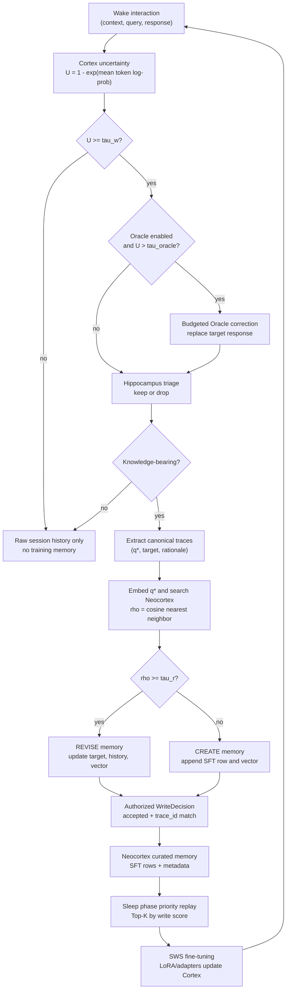

<div align="center">
  
</div>

<h1 align="center">Learning What to Learn: Hippocampal Memory Consolidation for Continual Model Adaptation</h1>

<div align="center">
  <p>
    <em>A memory-centric continual learning mechanism inspired by hippocampal–neocortical consolidation in the mammalian brain.</em>
  </p>
  <p>
    <strong>Selective Memory, Sleep Consolidation, Continual Self-Adaption</strong>
  </p>
</div>

## Abstract

Contemporary language models are trained on internet-scale corpora and scaled to massive parameter regimes, incurring substantial costs in training, deployment, and continual adaptation.
Human cognition, by contrast, is selective and experience-driven, relying on hippocampal mechanisms that preferentially encode salient, novel, and behaviorally relevant experiences and coordinate their gradual consolidation into long-term neocortical memory.
We propose **Hippocampus-Augmented Transformer (HAT)**, a memory-centric continual learning mechanism inspired by hippocampal–neocortical consolidation in the mammalian brain.
HAT enables language models to learn _what to learn_ from interaction by coupling online experience acquisition with offline memory consolidation.
During interaction, a base model (the _Cortex_) processes inputs while a _Hippocampus Agent_ gates uncertain turns, abstracts them into structured memory traces, routes each trace to create or revise long-term memory, and optionally queries an external oracle when needed.
Selected experiences are progressively consolidated into a persistent _Neocortex_ memory and subsequently replayed during slow-wave sleep (SWS), where the Cortex is updated through parameter-efficient fine-tuning.
This wake–sleep separation transforms sparse, interaction-driven feedback into reusable training signals, enabling continual self-improvement without indiscriminate data accumulation.
We evaluate HAT on knowledge-intensive question answering, instruction following, and personalization benchmarks, demonstrating consistent improvements over fine-tuning and retrieval-augmented baselines under continual adaptation settings.

## Overview & Architecture

<p align="center">
  
</p>

HAT enables small language models to continually improve by turning only high-value interactions into curated memory traces, which are then replayed during simulated "sleep" phases for parameter updates. The learning process operates in two main phases:

- **Wake Phase (Online Interaction)**: The _Cortex_ responds to users. The _Hippocampus Agent_ gates uncertain turns, extracts canonical knowledge traces, routes each trace to **CREATE** a new memory or **REVISE** an existing one, and commits only authorized writes to the _Neocortex_.
- **Sleep Phase (Offline Consolidation)**: During Slow-Wave Sleep (SWS), high-score memories in the _Neocortex_ are replayed. The _Cortex_ parameters are efficiently updated via fine-tuning (e.g., using adapters).

## Key Algorithm Flow

At a glance, HAT is a gated memory-consolidation loop: the model does not learn from every chat turn; it learns from traces that survive uncertainty gating, abstraction, semantic routing, and authorized memory writes.



## Related Work

### Self-Evolution and Continual Adaptation

**[A Survey on Self-Evolution of Large Language Models](https://arxiv.org/abs/2404.14387)** *(2024-04)*
Comprehensive survey of self-evolution approaches in LLMs, proposing a conceptual framework that outlines the evolving process as iterative cycles of experience acquisition, refinement, updating, and evaluation. Directly aligns with HAT's vision of autonomous LLM improvement through experiential learning.

**[Awesome-Self-Evolution-of-LLM (Alibaba DAMO Reading List)](https://github.com/AlibabaResearch/DAMO-ConvAI/tree/main/Awesome-Self-Evolution-of-LLM)** *(actively maintained)*
Maintained paper repository accompanying the survey, covering most works in its taxonomy and serving as a high-value index for fast literature expansion around self-evolution and agent memory.

**[Transformer-Squared: Self-adaptive LLMs](https://arxiv.org/abs/2501.06252)** *(2025-01)*
Proposes a self-adaptation framework that adapts LLMs for unseen tasks in real-time by selectively adjusting singular components of weight matrices. Similar goal to HAT but via online weight updates rather than replay-based consolidation. ⚠ No memory or replay mechanism; weakly related to HAT's core.

**[Self-Adapting Language Models (SEAL)](https://arxiv.org/abs/2506.10943)** *(2025-06)*
Framework enabling LLMs to self-adapt by generating their own finetuning data and update directives. Uses RL with downstream performance as reward, conceptually close to HAT's self-improvement paradigm but with different mechanisms.

**[SELF: Self-Evolution with Language Feedback](https://arxiv.org/abs/2310.00533)** *(2023-10)*
Proposes iterative self-evolution via self-feedback, self-refinement, and repeated fine-tuning on enhanced model-generated data. Strongly related to HAT's closed-loop improvement through autonomous experience transformation.

**[Self-Rewarding Language Models](https://arxiv.org/abs/2401.10020)** *(2024-01)*
Uses the model itself as a reward provider (LLM-as-a-Judge) within iterative preference optimization. Particularly relevant to HAT's future memory-importance scoring and autonomous quality evaluation.

**[Principle-Driven Self-Alignment of Language Models from Scratch with Minimal Human Supervision](https://arxiv.org/abs/2305.03047)** *(2023-05)*
Introduces a low-supervision self-alignment pipeline that synthesizes prompts, generates principle-guided responses, and refines the base model through self-generated training data. ⚠ Focuses on instruction alignment rather than memory or continual learning; weakly related to HAT's core.

### Selective Data Refinement and Memory Curation

**[Selective Reflection-Tuning: Student-Selected Data Recycling for LLM Instruction-Tuning](https://arxiv.org/abs/2402.10110)** *(2024-02)*
Synergizes teacher-student collaboration for data refinement, where the teacher improves existing data quality and the student selects compatible examples. Addresses data selection for continual learning, a core concern of HAT's selective consolidation.

**[Learning What to Remember: A Cognitively Grounded Multi-Factor Value Model for Agentic Memory](https://arxiv.org/abs/2606.12945)** *(2026-06)*
Proposes a learned multi-factor memory value function drawing from cognitive psychology (emotional intensity, goal relevance, reliability, etc.). Directly addresses the forgetting decision and memory prioritization problem central to HAT's consolidation mechanism.

**[Agentic Memory: Learning Unified Long-Term and Short-Term Memory Management for Large Language Model Agents](https://arxiv.org/abs/2601.01885)** *(2026-01)*
Introduces a unified memory policy that treats short-term and long-term memory operations as learnable agent actions (store, retrieve, update, summarize, discard), optimized with reinforcement learning. Closely related to HAT's goal of end-to-end memory management beyond static heuristics.

**[In Prospect and Retrospect: Reflective Memory Management for Long-term Personalized Dialogue Agents](https://arxiv.org/abs/2503.08026)** *(2025-03)*
Presents reflective memory management with prospective summarization across multiple granularities and retrospective retrieval refinement through online RL. Provides a strong personalized-dialogue perspective on adaptive memory curation relevant to HAT's selective consolidation.

**[MemoryBank: Enhancing Large Language Models with Long-Term Memory](https://arxiv.org/abs/2305.10250)** *(2023-05)*
Early long-term memory framework for LLM dialogue systems, emphasizing memory updates, selective forgetting, and reinforcement over time. Its forgetting-curve-inspired design is a useful precursor to modern memory-value and consolidation strategies.

**[MemGPT: Towards LLMs as Operating Systems](https://arxiv.org/abs/2310.08560)** *(2023-10)*
Introduces virtual context management with multi-tier memory and automatic memory migration across tiers. Highly relevant to HAT's hippocampus-neocortex separation and long-horizon memory control.

**[Reflexion: Language Agents with Verbal Reinforcement Learning](https://arxiv.org/abs/2303.11366)** *(2023-03)*
Proposes verbal reinforcement learning where agents reflect on task failures in natural language, store reflections in an episodic memory buffer, and leverage them in subsequent trials. One of HAT's closest ancestors: fail → reflect → write to memory → use in next turn.

**[Think-in-Memory: Recalling and Post-thinking Enable LLMs with Long-Term Memory](https://arxiv.org/abs/2311.08719)** *(2023-11)*
Stores and updates intermediate thoughts as evolving memory with insert/forget/merge operations and efficient retrieval. Closely related to HAT's trace abstraction and memory lifecycle management.

**[MoT: Memory-of-Thought Enables ChatGPT to Self-Improve](https://arxiv.org/abs/2305.05181)** *(2023-05)*
Builds external memory from high-confidence pre-thinking traces and reuses it for test-time reasoning improvement. Conceptually adjacent to HAT's idea of transforming interaction traces into reusable learning assets.

**[A Survey on the Memory Mechanism of Large Language Model based Agents](https://arxiv.org/abs/2404.13501)** *(2024-04)*
Provides a systematic review of memory design and evaluation in LLM agents, covering core module patterns and open challenges. Useful for situating HAT's hippocampus-neocortex decomposition within broader agent-memory architectures.

### Self-Improvement Through Bootstrapped Reasoning

**[STaR: Bootstrapping Reasoning With Reasoning](https://arxiv.org/abs/2203.14465)** *(2022-03)*
Pioneering work on self-taught reasoning: iteratively fine-tune LLMs on self-generated solutions, filtering for correctness. The self-improvement loop inspired by human learning aligns with HAT's wake-sleep separation and experiential consolidation.

**[V-STaR: Training Verifiers for Self-Taught Reasoners](https://arxiv.org/abs/2402.06457)** *(2024-02)*
Extends STaR by training a verifier to judge solution correctness, using both correct and incorrect solutions. Introduces quality assessment via verification, complementary to HAT's uncertainty-based gating and triage mechanisms.

**[START: Self-taught Reasoner with Tools](https://arxiv.org/abs/2503.04625)** *(2025-03)*
Introduces Hint-infer and Hint Rejection Sampling Fine-Tuning (Hint-RFT) for reasoning LLMs with tool invocation. Combines self-learning and fine-tuning, similar to HAT's replay-based parameter updates but for reasoning-specific tasks.

**[Reinforced Self-Training (ReST) for Language Modeling](https://arxiv.org/abs/2308.08998)** *(2023-08)*
Presents an offline self-training framework that generates policy data and improves models via iterative reinforcement-style updates with data reuse. Methodologically relevant to HAT's replay-centric, sample-efficient consolidation perspective.

**[ReST meets ReAct: Self-Improvement for Multi-Step Reasoning LLM Agent](https://arxiv.org/abs/2312.10003)** *(2023-12)*
Combines ReAct-style tool-using trajectories with ReST-like iterative improvement and self-distillation. Closely connected to HAT's wake-sleep style loop that converts interaction traces into subsequent parameter updates.

**[Large Language Models Can Self-Improve](https://arxiv.org/abs/2210.11610)** *(2022-10)*
Classic self-training approach that selects high-confidence rationale-augmented outputs from unlabeled data and fine-tunes on them. A foundational reference for HAT's selective consolidation and replay-style updates.

### Self-Supervised Evolution

**[Self-Evolving Vision-Language Models for Image Quality Assessment via Voting and Ranking (EvoQuality)](https://arxiv.org/abs/2509.25787)** *(2025-09)*
Demonstrates self-supervised fine-tuning of VLMs via pseudo-label generation through pairwise voting and group relative policy optimization. ⚠ Domain-specific (image quality); the self-consistency principle offers methodological reference but HAT's core concerns are largely orthogonal.

## Citation

If you find our work or this code helpful in your research, please cite our paper:

```bibtex
@inproceedings{hat2026learning,
  title={Learning What to Learn: Hippocampal Memory Consolidation for Continual Model Adaptation},
  author={Anonymous Authors},
  booktitle={Advances in Neural Information Processing Systems (NeurIPS)},
  year={2026}
}
```
