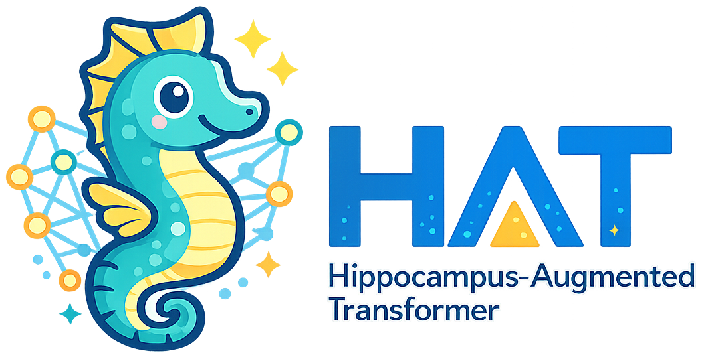
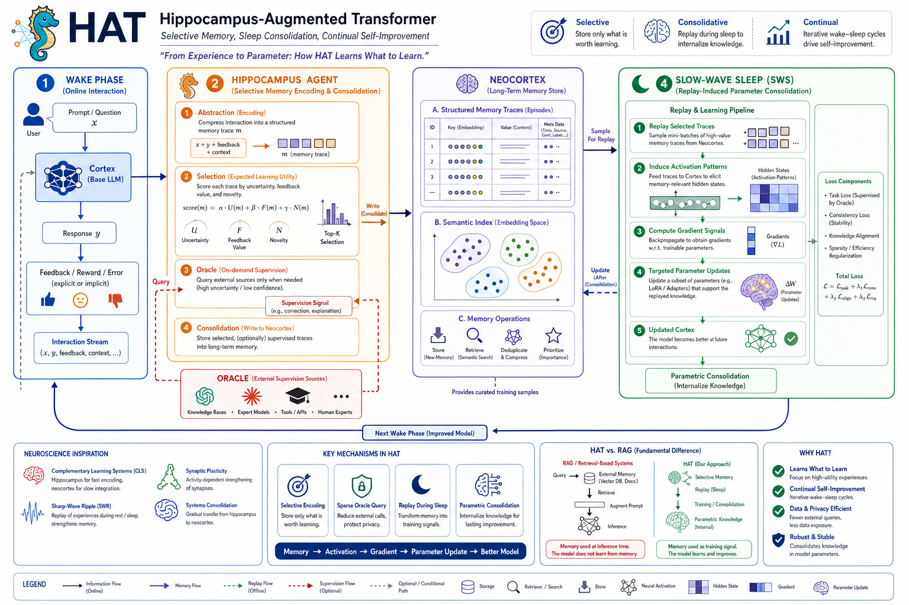
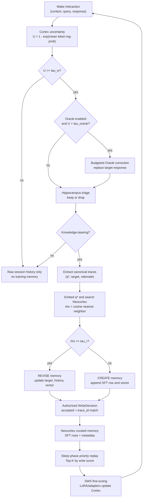

<div align="center">
  
</div>

<h1 align="center">Learning What to Learn: Hippocampal Memory Consolidation for Continual Model Adaptation</h1>

<div align="center">
  <p>
    <em>A memory-centric continual learning mechanism inspired by hippocampal–neocortical consolidation in the mammalian brain.</em>
  </p>
  <p>
    <strong>Selective Memory, Sleep Consolidation, Continual Self-Adaption</strong>
  </p>
</div>

## Abstract

Contemporary language models are trained on internet-scale corpora and scaled to massive parameter regimes, incurring substantial costs in training, deployment, and continual adaptation.
Human cognition, by contrast, is selective and experience-driven, relying on hippocampal mechanisms that preferentially encode salient, novel, and behaviorally relevant experiences and coordinate their gradual consolidation into long-term neocortical memory.
We propose **Hippocampus-Augmented Transformer (HAT)**, a memory-centric continual learning mechanism inspired by hippocampal–neocortical consolidation in the mammalian brain.
HAT enables language models to learn _what to learn_ from interaction by coupling online experience acquisition with offline memory consolidation.
During interaction, a base model (the _Cortex_) processes inputs while a _Hippocampus Agent_ gates uncertain turns, abstracts them into structured memory traces, routes each trace to create or revise long-term memory, and optionally queries an external oracle when needed.
Selected experiences are progressively consolidated into a persistent _Neocortex_ memory and subsequently replayed during slow-wave sleep (SWS), where the Cortex is updated through parameter-efficient fine-tuning.
This wake–sleep separation transforms sparse, interaction-driven feedback into reusable training signals, enabling continual self-improvement without indiscriminate data accumulation.
We evaluate HAT on knowledge-intensive question answering, instruction following, and personalization benchmarks, demonstrating consistent improvements over fine-tuning and retrieval-augmented baselines under continual adaptation settings.

## Overview & Architecture

<p align="center">
  
</p>

HAT enables small language models to continually improve by turning only high-value interactions into curated memory traces, which are then replayed during simulated "sleep" phases for parameter updates. The learning process operates in two main phases:

- **Wake Phase (Online Interaction)**: The _Cortex_ responds to users. The _Hippocampus Agent_ gates uncertain turns, extracts canonical knowledge traces, routes each trace to **CREATE** a new memory or **REVISE** an existing one, and commits only authorized writes to the _Neocortex_.
- **Sleep Phase (Offline Consolidation)**: During Slow-Wave Sleep (SWS), high-score memories in the _Neocortex_ are replayed. The _Cortex_ parameters are efficiently updated via fine-tuning (e.g., using adapters).

## Key Algorithm Flow

At a glance, HAT is a gated memory-consolidation loop: the model does not learn from every chat turn; it learns from traces that survive uncertainty gating, abstraction, semantic routing, and authorized memory writes.



## Citation

If you find our work or this code helpful in your research, please cite our paper:

```bibtex
@inproceedings{hat2026learning,
  title={Learning What to Learn: Hippocampal Memory Consolidation for Continual Model Adaptation},
  author={Anonymous Authors},
  booktitle={Advances in Neural Information Processing Systems (NeurIPS)},
  year={2026}
}
```
