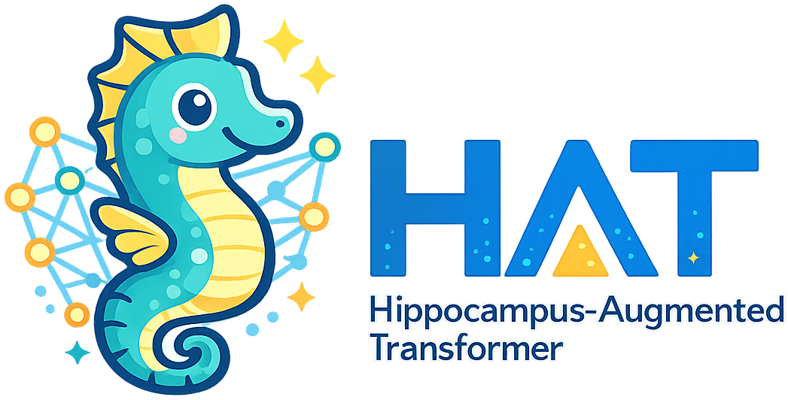
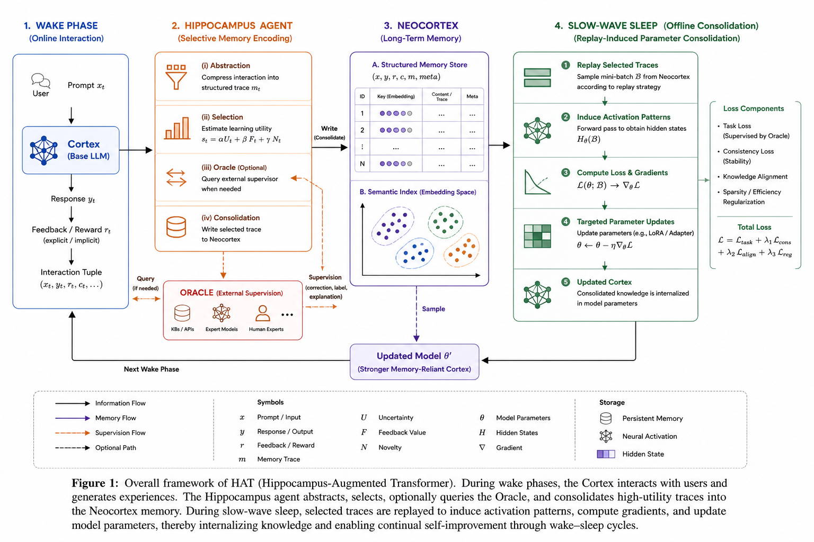

<p align="center">
  
</p>

<h1 align="center">Learning What to Learn: Hippocampal Memory Consolidation for Continual Model Adaptation</h1>

<div align="center">
  <p>
    <em>A memory-centric continual learning mechanism inspired by hippocampal–neocortical consolidation in the mammalian brain.</em>
  </p>
  <p>
    <strong>Selective Memory, Sleep Consolidation, Continual Self-Improvement</strong>
  </p>
</div>

## Abstract

Contemporary language models are trained on internet-scale corpora and scaled to massive parameter regimes, incurring substantial costs in training, deployment, and continual adaptation. Human cognition, by contrast, is selective and experience-driven, relying on hippocampal mechanisms that preferentially encode salient, novel, and behaviorally relevant experiences and coordinate their gradual consolidation into long-term neocortical memory.

We propose **Hippocampus-Augmented Transformer (HAT)**, a memory-centric continual learning mechanism inspired by hippocampal–neocortical consolidation in the mammalian brain. HAT enables language models to learn _what to learn_ from interaction by coupling online experience acquisition with offline memory consolidation. During interaction, a base model (the _Cortex_) processes inputs while a _Hippocampus Agent_ encodes interactions and feedback into structured memory traces and selectively retains informative experiences based on uncertainty, novelty, and supervision signals, optionally querying an external oracle when needed. Selected experiences are progressively consolidated into a persistent _Neocortex_ memory and subsequently replayed during slow-wave sleep (SWS), where the Cortex is updated through parameter-efficient fine-tuning. This wake–sleep separation transforms sparse, interaction-driven feedback into reusable training signals, enabling continual self-improvement without indiscriminate data accumulation. We evaluate HAT on knowledge-intensive question answering, instruction following, and personalization benchmarks, demonstrating consistent improvements over fine-tuning and retrieval-augmented baselines under continual adaptation settings.

## Overview & Architecture

<p align="center">
  
</p>

HAT enables small language models to continually improve by structuring interactions into selective memory traces, which are then replayed during simulated "sleep" phases for parameter updates. The learning process operates in two main phases:

- **Wake Phase (Online Interaction)**: The _Cortex_ model interacts with users. The _Hippocampus Agent_ transforms these interactions into structured memory traces, selects highly informative ones based on uncertainty and novelty, and commits them to the _Neocortex_ memory.
- **Sleep Phase (Offline Consolidation)**: During Slow-Wave Sleep (SWS), accumulated experiences in the _Neocortex_ are replayed. The _Cortex_ model parameters are efficiently updated via fine-tuning (e.g., using adapters).

## Citation

If you find our work or this code helpful in your research, please cite our paper:

```bibtex
@inproceedings{hat2026learning,
  title={Learning What to Learn: Hippocampal Memory Consolidation for Continual Model Adaptation},
  author={Anonymous Authors},
  booktitle={Advances in Neural Information Processing Systems (NeurIPS)},
  year={2026}
}
```
